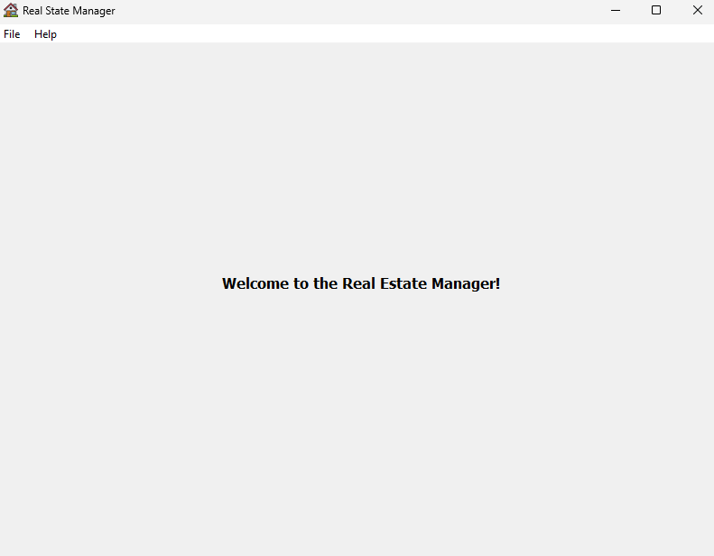
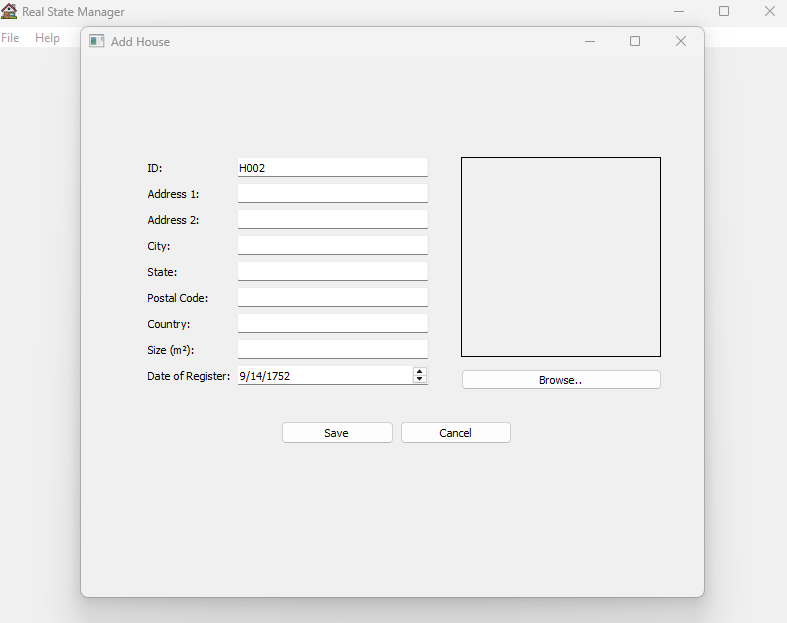
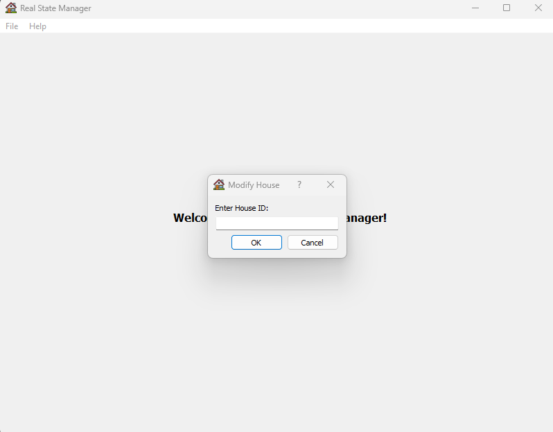
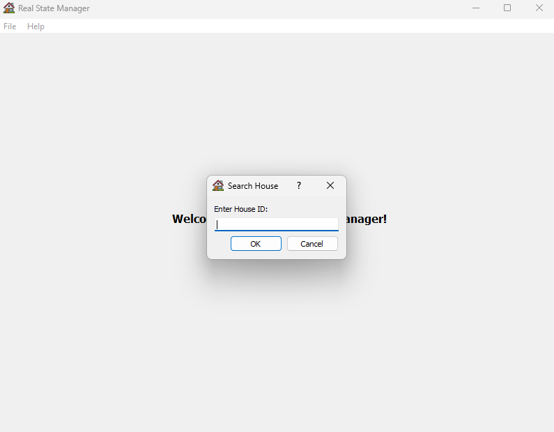
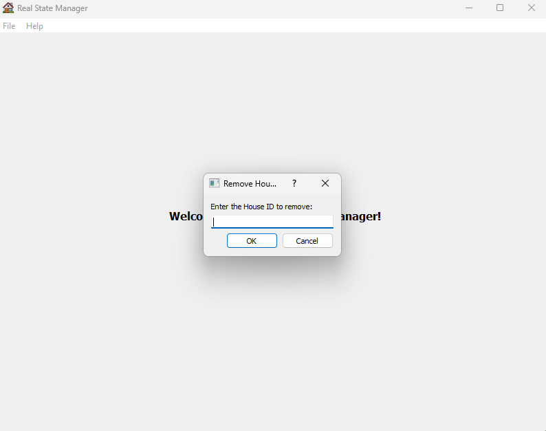
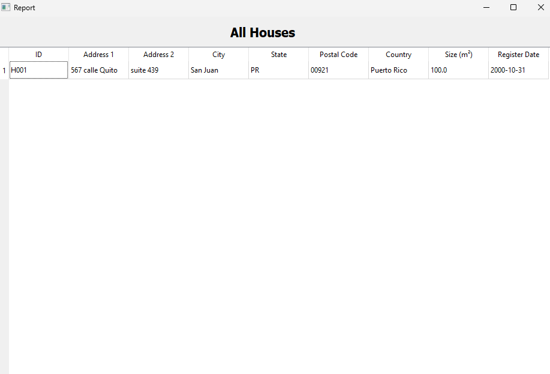
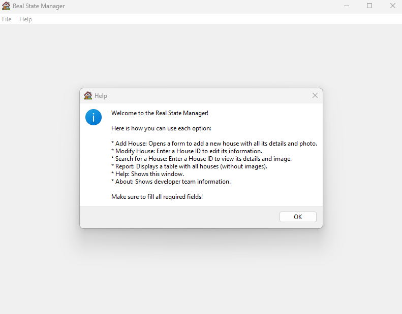

# Real Estate Manager 🏡

A desktop application built with **Python** and **PyQt5** to manage real estate property listings, with full CRUD operations and image support.

---

## ✨ Features

- 📋 View full list of properties in a dynamic table
- ➕ Add new houses with address, size, and photo
- 🛠 Modify existing listings by ID
- 🔎 Search houses by ID (with photo preview)
- ❌ Remove listings after confirmation
- 📊 MySQL backend for persistent storage
- 💡 Clean UI with `.ui` files (Qt Designer)
- 🔐 Secure DB credentials using `.env` file

---

## 📁 Project Structure

```
Real-Estate-Manager-main/
│
├── main.py                     # Entry point
├── RealStateDB.sql             # MySQL database schema
├── .env.example                # Sample environment config
│
├── BackendSection/             # App logic
│   ├── DBConnection.py         # MySQL DB connector
│   ├── AddHouse.py             # Add functionality
│   ├── ModifyHouse.py          # Modify functionality
│   ├── ViewHouse.py            # View functionality
│   └── ...
│
├── UiFolder/                   # Qt .ui design files
│   └── MainWindow.ui, AddHouse.ui, etc.
│
├── icons/                      # App icons
├── photos/                     # Sample house photos
├── .env                        # Needs to be created
└── README.md                   # This file
```

---

### 🔧 Prerequisites

- Python 3.11 or later
- MySQL running locally
- `pip install -r requirements.txt`

```
requirements.txt :
cffi==1.17.1
cryptography==45.0.3
packaging==25.0
pycparser==2.22
PyMySQL==1.1.1
PyQt5==5.15.11
PyQt5-Qt5==5.15.2
PyQt5_sip==12.17.0
python-dotenv==1.1.0
PyTMX==3.32
setuptools==80.7.1
sip==6.11.0
```

### 🔑 The `.env` file
# This will be created manually at the root of the project.
```env
DB_HOST=localhost
DB_USER=root
DB_PASS=yourpassword <-- This is replaced with the password 
DB_NAME=RealStateDB
```

### 💽 Create the database

```sql
-- In MySQL
SOURCE RealStateDB.sql;
```

### 🚀 Run the App

```bash
python main.py
```

---

## 📦 Dependencies

```bash
pip install PyQt5 pymysql python-dotenv
```

---

## 📸 Screenshots

### 🏠 Main Window


### ➕ Add House


### 📝 Modify House


### 🔍 Search House


### ❌ Remove House


### 📋 Report Window


### ❓ Help Window


---

## 💡 Notes

- `.env` is git-ignored for security
- Images are displayed using relative paths in-app
- Built for academic use
